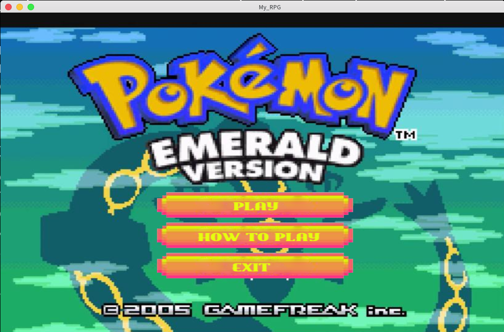
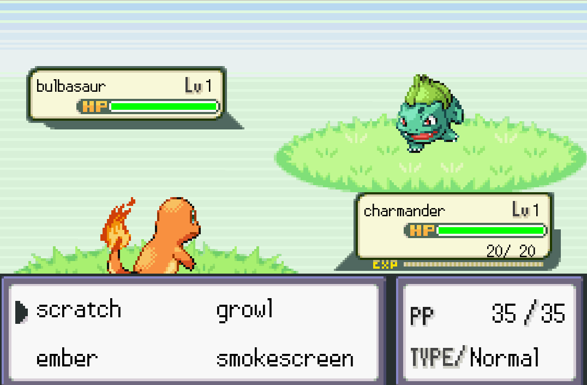
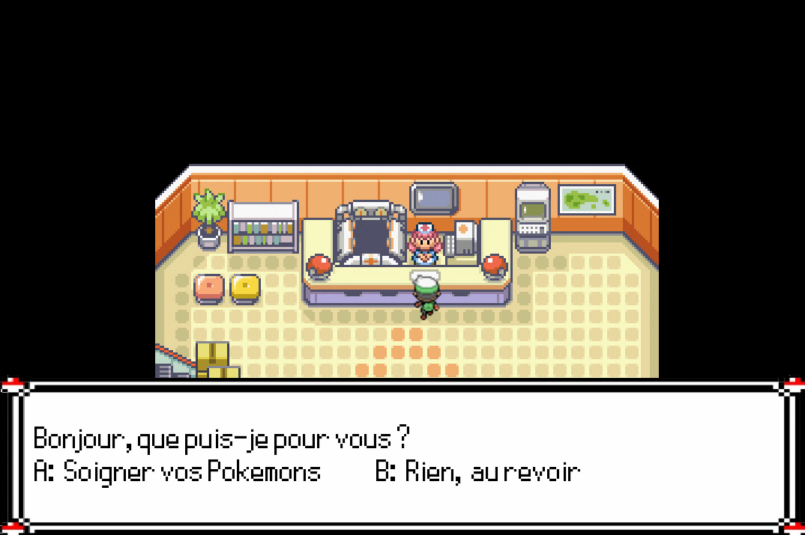
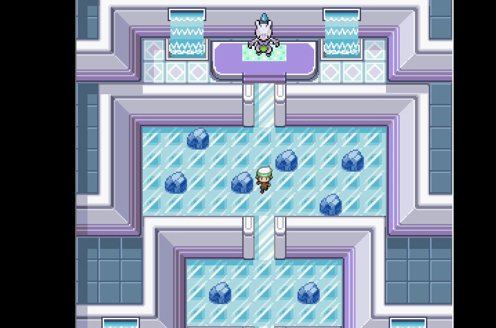

# my_rpg

## A Role Play Game coded in C with the CSML library



## Requirements
* GCC
* CSFML library

## Usage

``` zsh
make
./my_rpg
```
With this project I learned graphical programming, how to use CFSML and collaborating with 3 teammates (Mathis Lesur, Louis Maestre and Simon LeFourn).

## Features

- A huge map
- Dialogues
- Fights
- A final boss

## Screenshots






